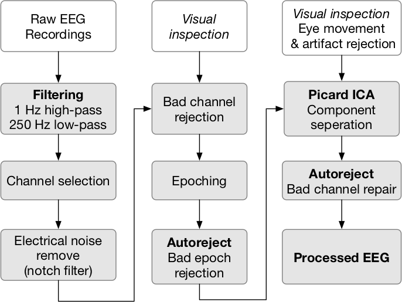

# Get started with EEG!
One of the main modalities we use in our lab to study Human-robot interaction is EEG (others include EMG, haptics). Here are some resources which introduce you to the analysis of EEG and physiological signal processing in general.

# EEG Glossary
[A revised glossary of terms most commonly used by clinicalelectroencephalographers and updated proposal for the reportformat of the EEG findings. Revision 2017](https://www.researchgate.net/publication/318904019_A_revised_glossary_of_terms_most_commonly_used_by_clinical_electroencephalographers_and_updated_proposal_for_the_report_format_of_the_EEG_findings)

## Setting up EEG recordings
Here is a small video on how to setup advanced brain monitoring electrodes for EEG recording.

> **Tips!**
> Please feel free to drop by the lab to get more information

## EEG analysis steps
For those who are starting with EEG analysis, it can be overwhelming to go across a lot of steps. Here is almost a standard procedure for a lot of EEG analysis. Each block is a research area by itself. There are a lot of papers on each block. Do not get scared once you start the analysis of some EEG data, these steps will become second to your nature. Do read below given paper about how others are doing these steps. We use [mne-python](https://www.nmr.mgh.harvard.edu/mne/stable/index.html) to implement different block functionalities. If you want more information, refer to [Mike X Cohen's lectures](http://mikexcohen.com/lectures.html)

## MNE
In the lab, we extensively use [mne-python](https://www.nmr.mgh.harvard.edu/mne/stable/index.html) for analysis of a lot of EEG (time series in general) data. It is an amazing package with a lot of development and an amazing community. If you get a chance, do join the [mailing list.](https://mail.nmr.mgh.harvard.edu/mailman/listinfo/mne_analysis)

Here are some resources to get you started with mne-python

* [Basic mne-python](https://mybinder.org/v2/gh/wmvanvliet/SNL_workshop_2019/master?filepath=SNL_workshop_2019.ipynb)

* [Intermediate mne-python tutorials](https://mne.tools/0.14/tutorials.html)

## EEG databases
Here are some databases on which you are apply your mne-python skills.

> **Tips!**
> The best way to learn a (Python) package is to use it on your own data and see what are the capabilities

Pick up some data from this repository: [meagmohit/EEG-Datasets](https://github.com/meagmohit/EEG-Datasets). Use mne-python do some analysis and that is how you get introduced to analysis of EEG.

> **Tips!**
> If you have doubts, do drop by to HILS lab and ask any questions!

## Papers

* [Best Practices in Data Analysis and Sharing in Neuroimaging using MEEG.](https://osf.io/a8dhx/)

* [A Reproducible MEG/EEG Group Study With the MNE Software: Recommendations, Quality Assessments, and Good Practices](https://www.frontiersin.org/articles/10.3389/fnins.2018.00530/full)

* [EEG artifact removal—state-of-the-art and guidelines](https://search.lib.buffalo.edu/discovery/fulldisplay?docid=iop10.1088/1741-2560/12/3/031001&context=PC&vid=01SUNY_BUF:everything&search_scope=UBSUNY&tab=EverythingUBSUNY&lang=en)

## GitHub Links
### Analysis Related Repositories
* https://github.com/sappelhoff/pyprep
* https://github.com/autoreject/autoreject
* https://github.com/mdelpozobanos/eegfaster
* https://github.com/neurodsp-tools/neurodsp
* https://github.com/PIA-Group/BioSPPy
* https://github.com/cancui/EMG-Signal-Processing-Library
* https://github.com/unpingco/Python-for-Signal-Processing

### Usefull Libraries and Links
* http://www.marsja.se/best-python-libraries-psychology/
* https://github.com/NeuroDataDesign
* https://github.com/NeuroTechX/eeg-notebooks
* https://github.com/openlists/OpenTools/blob/master/README.md
* https://github.com/mne-tools/mne-study-template
* https://swipe4ica.github.io/#/ (This is an interesting way to learn how to identify artifacts in EEG)
* https://labeling.ucsd.edu/label (Similar to previous link)

### DeepLearning with Physiological Signals
* https://github.com/vlawhern/arl-eegmodels
* https://github.com/EderSantana/DeepEEG
* https://robintibor.github.io/braindecode/index.html
* https://github.com/mne-tools/mne-torch

